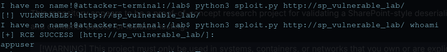

# CVE-2025-53770 Research Lab

This repository appears to be a proof-of-concept research project for validating a SharePoint-style deserialization and tool-pane processing issue in a controlled lab. It includes a Python driver, a mock vulnerable application, and container assets for isolated testing.

> [!WARNING]
> This project must only be used in systems, containers, or networks that you own or are explicitly authorized to test. Do not run this code against public infrastructure, third-party services, production environments, or any target without written permission. Unauthorized security testing may violate law, contract, policy, or acceptable use terms.
>
> The contents of this repository should be treated as sensitive security research material. If you use this project for assessment work, keep execution isolated, log all activity, and coordinate with the system owner before testing.

<div align="center">
    
</div>

## Project Scope

The repository currently contains:

- `sploit.py`: asynchronous Python driver that submits crafted requests to a ToolPane endpoint.
- `lab/mock_vulnerable_app.cs`: mock ASP.NET application that reflects a validation marker and, in its current form, can execute a supplied command inside the lab container.
- `lab/docker-compose.yml`: local two-container lab that separates the mock target from the attacker terminal.
- `lab/Dockerfile`: multi-stage .NET build that publishes the mock vulnerable application into a smaller ASP.NET runtime image and runs it as a non-root user.
- `lab/attacker.Dockerfile`: Python attacker container definition that preinstalls the script dependency set needed for the lab terminal.
- `lab/vulnerable.csproj`: .NET 6 web project file for the mock vulnerable application.
- `lab/genGadget.py`: helper script for generating a compressed Base64 payload for lab-only deserialization testing.

## Setup & Usage

This workflow is intended for the local lab only.

Prerequisites:

- Docker Engine with Compose support
- A local shell with permission to run Docker commands

Start the lab from the `lab/` directory:

```bash
cd lab
docker-compose up --build -d
```

If your Docker setup requires elevated privileges, run the same commands with `sudo`.

Confirm both containers are running:

```bash
docker-compose ps
```

Logging incase of issues or exploit validation:

```bash
docker logs sp_attacker
docker logs sp_vulnerable_lab
```

The lab is intentionally isolated:

- the target container runs on the internal `lab_net` network;
- no ports are published to the host;
- the attacker container is provided as a disposable terminal inside the same private network.

Open a shell in the attacker container:

```bash
docker exec -it sp_attacker bash
```

From inside the attacker container, you can perform lab-safe checks such as confirming the target is reachable and testing the script in verification mode against the mock target:

```bash
python3 sploit.py http://sp_vulnerable_lab/
# If service-name DNS resolution fails in your environment, use the lab IP:
# python3 sploit.py http://10.10.10.5
```

Expected behavior in the local mock environment:

- the target should be reachable as `http://sharepoint-target` from the attacker container;
- the mock application returns a deterministic marker for verification;
- any result artifacts produced by the script remain inside the mounted lab workspace.

Operational notes:

- keep the lab disconnected from external networks and do not publish the target service to the host;
- do not reuse this environment for production assessment;
- if you modify the mock application or container definitions, rebuild the images before retesting.

## Cleanup

Stop and remove the lab containers and network:

```bash
cd lab
docker-compose down
```

If you want to remove built images as well:

```bash
docker-compose down --rmi local
```

If you want a full reset of the lab workspace artifacts, remove any generated result files after shutdown:

```bash
rm -f vuln.lst
```

Recommended cleanup practice after each exercise:

1. shut down the lab with `docker-compose down`;
2. remove result artifacts that should not persist;
3. rebuild the lab before the next run if you changed code, dependencies, or container settings.

## Validation Summary

The project is structurally valid as a local research lab, but it should not be treated as a production-safe validator in its current form.

What is working:

- The lab topology is simple and reproducible.
- The Python driver can test one target or a list of targets.
- The mock application gives deterministic success indicators for lab verification.

What needs caution:

- The main script includes explicit command-execution behavior when a second argument is provided.
- TLS verification is disabled in outbound requests.
- Positive findings are written to `vuln.lst`, which may create unnecessary residual sensitive data.
- The mock application executes shell input directly and should never be exposed outside an isolated lab.

## Methodology

Use this project only for controlled validation of detection and exposure, not for operational exploitation.

Recommended methodology:

1. Build an isolated lab environment with no external exposure.
2. Validate network boundaries so only the researcher can reach the mock service.
3. Run the lab target and confirm the application responds to the intended endpoint.
4. Use the driver only in non-destructive verification mode to confirm whether the target reflects the expected marker.
5. Capture request and response artifacts for documentation, then destroy the lab environment after testing.

For real-world assessment work, the safer standard is to replace exploit-style validation with one or more of the following:

- version and patch-level verification;
- authenticated configuration review;
- web-tier log analysis;
- EDR, SIEM, and WAF telemetry review;
- vendor-provided indicators of compromise and health checks.

## Impact

If a target is genuinely vulnerable to a deserialization flaw in a privileged application component, the potential impact can be severe:

- remote code execution in the security context of the affected service;
- loss of confidentiality for application data, credentials, and secrets;
- loss of integrity through content or configuration tampering;
- availability degradation from destructive commands or follow-on actions;
- lateral movement opportunities if the host has broad network or identity privileges.

Even in a lab, command-execution semantics significantly raise risk because they normalize workflows that should be reserved for tightly controlled, authorized investigation.

## Mitigations

The proper mitigation path is defensive and layered.

Immediate actions:

1. Apply vendor security updates and emergency guidance for the affected product version.
2. Remove public exposure or restrict access to the vulnerable application surface.
3. Rotate credentials and review privileged service accounts if compromise is suspected.
4. Inspect logs, scheduled tasks, child processes, and outbound connections for post-exploitation activity.
5. Preserve evidence before cleanup if the environment may already be compromised.

Hardening actions:

1. Enforce network segmentation around SharePoint or equivalent application tiers.
2. Place the service behind a reverse proxy, WAF, or equivalent filtering control.
3. Reduce service-account privilege and local execution capability wherever possible.
4. Enable centralized logging and alerting for suspicious requests to `/_layouts/15/ToolPane.aspx` and adjacent administrative paths.
5. Monitor for unexpected process creation from the application worker context.

Research-lab specific mitigations:

1. Keep the lab on an isolated bridge network with no host port publishing.
2. Remove command-execution code from the mock application unless it is strictly required for a controlled demonstration.
3. Separate benign validation from any dangerous functionality into different scripts or branches.
4. Avoid storing positive target lists unless there is a documented retention need.
5. Destroy and rebuild the lab after each exercise.

## Disclaimer

This README does not provide instructions for exploiting live systems. It documents the repository as a controlled research artifact and outlines safer validation and mitigation practices.

## References

- [CVE.org: CVE-2025-53770](https://www.cve.org/CVERecord?id=CVE-2025-53770) - canonical CVE record with CNA metadata, affected version ranges, CVSS, and linked references.
- [NVD: CVE-2025-53770 Detail](https://nvd.nist.gov/vuln/detail/CVE-2025-53770) - NIST enrichment, CPE coverage, CWE mapping, and reference aggregation.
- [Microsoft Security Update Guide: CVE-2025-53770](https://msrc.microsoft.com/update-guide/vulnerability/CVE-2025-53770) - primary vendor advisory with impact, exploitability, mitigations, and security update information.
- [Microsoft Learn: Configure AMSI integration with SharePoint Server](https://learn.microsoft.com/sharepoint/security-for-sharepoint-server/configure-amsi-integration) - Microsoft hardening guidance referenced by the vendor advisory for mitigation and validation.
- [Microsoft MSRC Blog: Customer guidance for SharePoint vulnerability CVE-2025-53770](https://msrc.microsoft.com/blog/2025/07/customer-guidance-for-sharepoint-vulnerability-cve-2025-53770/) - vendor guidance and response context for active exploitation.
- [CISA Alert: Microsoft Releases Guidance for Exploitation of SharePoint Vulnerability CVE-2025-53770](https://www.cisa.gov/news-events/alerts/2025/07/20/microsoft-releases-guidance-exploitation-sharepoint-vulnerability-cve-2025-53770) - U.S. government alerting and operational response guidance.
- [CISA Known Exploited Vulnerabilities Catalog entry for CVE-2025-53770](https://www.cisa.gov/known-exploited-vulnerabilities-catalog?field_cve=CVE-2025-53770) - confirmation that the vulnerability was added to KEV along with remediation deadlines and action guidance.

## Author

* **[J4ck3LSyN](https://jackalsyn.com)**
* **[github](https://github.com/J4ck3LSyN-Gen2)**
